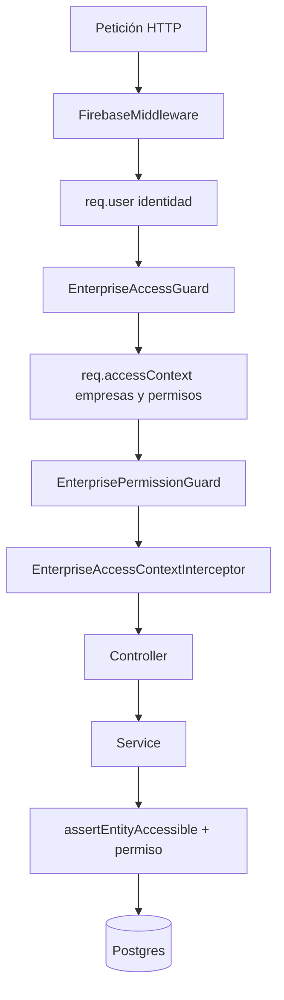

# Acceso por empresa

Capa de **autorización multi-empresa**: un usuario autenticado de la empresa X no puede leer ni mutar datos de la empresa Y, salvo que sea administrador global.

No es un segundo middleware HTTP. Firebase sigue resolviendo **quién eres**. Esta capa resuelve **a qué empresas puedes acceder**.

La tercera capa (**qué puedes hacer** dentro de esa empresa) está en [Permisos de rol de empresa](./enterprise-permissions.md). Toda ruta nueva o cambiada debe cumplir **ambas**.

## Por qué no un middleware nuevo

`FirebaseMiddleware` valida el Bearer token y carga `req.user`. Un middleware extra para empresas fallaría en tres puntos:

1. Nest reserva los metadatos de ruta (`@Skip…`, `@Require…`) a **Guards**, no a middlewares.
2. En listados el `enterpriseId` viaja en query o body; en `GET /invoices/:id` **no viaja**. El middleware no carga la factura, así que no puede saber si es de la empresa Y.
3. Facturas, presupuestos y gastos **no tienen** columna `enterpriseId`. El tenant está en `client` o `supplier`, y solo se ve en el servicio **después** del `findById`.

Billing ya hacía el patrón correcto (`req.user.id` → `user_enterprise` → 403). Esta capa lo generaliza.



Orden real en Nest: middleware → guards → interceptors → handler.

## Cuatro capas

### 1. Identidad — `FirebaseMiddleware`

Fichero: [`src/common/middleware/firebase/firebase.middleware.ts`](../src/common/middleware/firebase/firebase.middleware.ts).

- Exige `Authorization: Bearer <token>`.
- Verifica el token con Firebase Admin.
- Carga el usuario de Postgres **con** `userEnterprises`, para no repetir esa query en cada petición.
- Si el token es válido pero el email no existe en `users`, responde 403.

No decide si el usuario pertenece a una empresa. Solo deja `req.user` listo.

### 2. Contexto de acceso — `EnterpriseAccessService`

Fichero: [`src/common/helpers/enterprise-access/enterprise-access.service.ts`](../src/common/helpers/enterprise-access/enterprise-access.service.ts).

A partir de `req.user` construye un `AccessContext`:

| Campo | Significado |
|---|---|
| `userId` | `users.id` del caller |
| `isGlobalAdmin` | `users.role === administrator` |
| `allowedEnterpriseIds` | UUID únicos de `user_enterprise` |
| `permissionsByEnterpriseId` | JSONB del rol de cada vínculo (`enterprise_roles.permissions`) |

Un administrador global **salta el aislamiento** (panel Administración / CRUD de empresas). El resto solo opera sobre su set.

Métodos que importan en el día a día:

| Método | Cuándo | Si falla |
|---|---|---|
| `assertCanAccessEnterprise` | Hay `enterpriseId` en query/body/params (el Guard) | **403** |
| `assertEntityAccessible` | Tras cargar un recurso por id (servicios) | **404** (no revelar que existe) |
| `assertUserRecordAccessible` | Ver o editar otro usuario | **404** si no es él mismo, no comparte empresa y no es admin |
| `assertCanCreateEnterprise` | `POST /enterprises` | **403** si no es admin global |
| `assertCanPerformEnterprisePermission` | Hay `enterpriseId` y la ruta exige un permiso | **403** (deny by default) |
| `assertCurrentUserResourcePermission` | `GET/PATCH/DELETE /users/:id` sin query | **403** si no hay concesión en una empresa compartida |
| `mergeRelationNames` | Forzar `client` / `supplier` / `userEnterprises` en el `findById` | — |

Los servicios **no** reciben `Request`. El interceptor copia `req.accessContext` a AsyncLocalStorage; `assertCurrentEntityAccessible` lee ese almacén.

### 3. Guard NestJS — `EnterpriseAccessGuard`

Fichero: [`src/common/guards/enterprise-access.guard.ts`](../src/common/guards/enterprise-access.guard.ts).

Registrado como `APP_GUARD` en [`api.module.ts`](../src/api/api.module.ts). En cada petición autenticada:

1. Adjunta `req.accessContext`.
2. Extrae `enterpriseId` de, en este orden: **query** → **body.enterpriseId** → **body.userEnterprises[0].enterpriseId** → **params**.
3. Si la ruta tiene `@RequireEnterpriseId()` y no hay id → **400**.
4. Si hay id → `assertCanAccessEnterprise` (**403** si no hay vínculo, salvo admin global).
5. Si la ruta tiene `@SkipEnterpriseAccess()`, no valida el id (el contexto sí se adjunta).

Si no hay `req.user` (ruta pública o el middleware no corrió), el guard deja pasar. La autenticación sigue siendo responsabilidad de Firebase.

Esto cierra el agujero de `GET /clients?enterpriseId=Y` sin pertenecer a Y.

### 4. Permisos de rol de empresa — `EnterprisePermissionGuard`

Guía completa: [Permisos de rol de empresa](./enterprise-permissions.md).

Fichero: [`src/common/guards/enterprise-permission.guard.ts`](../src/common/guards/enterprise-permission.guard.ts).

Tercera capa de **autorización** (después de identidad y pertenencia). El JSONB de `enterprise_roles.permissions` es **disperso**: una clave ausente se deniega. El catálogo vive en código (`permission.catalog.ts`), no en una tabla.

- `@RequirePermission('clients', 'read')` en cada ruta de `src/api`.
- Si hay `enterpriseId` → evalúa el JSONB del rol de esa empresa. Sin concesión → **403**.
- Si no hay `enterpriseId` (UUID) → el guard deja pasar; el servicio llama a `assertCurrentEntityAccessible(..., { resource, action })` tras el `findById`.
- `users.role === administrator` **se salta el RBAC**, igual que el aislamiento de tenant.
- El rol de empresa `Administrador` persiste `{"*":{"read":true,"write":true,"delete":true}}`.
- El rol `Empleado` persiste `{}` (sin concesiones iniciales). No se puede borrar.
- `@SkipEnterprisePermission()` o `@SkipEnterpriseAccess()` omiten esta capa (`/users/myself`, catálogo Stripe, `POST /enterprises`, `DELETE /enterprises/:id`). El borrado de empresa lo autoriza `assertCanDeleteEnterprise` (solo admin global).

No hay grants extra por usuario: solo el rol del vínculo `user_enterprise.enterprise_role_id`.

## Decoradores

Fichero: [`src/common/decorators/enterprise-access.decorator.ts`](../src/common/decorators/enterprise-access.decorator.ts).

### `@RequireEnterpriseId()`

La petición **debe** traer `enterpriseId`. Usar en listados y altas que ya exigían el query.

Hoy está en (clase o método):

- Clientes, proveedores, series, ingresos recurrentes, peticiones IA
- Listado de facturas, presupuestos y gastos; preview IA de gastos
- Métricas, festivos, fichajes, vacaciones, horarios, plantillas de horario
- Alta / listado / búsqueda por tarjeta de usuarios
- Logo de empresa (`POST /enterprises/logo`)

### `@SkipEnterpriseAccess()`

No validar pertenencia. Usar cuando el recurso no es de una empresa, o el catálogo es público para el usuario autenticado.

Hoy:

- `GET /` (health)
- `GET /users/myself`
- Catálogo Stripe en billing (`products-by-metadata`, productos de fichajes y de gestión)

Billing **sigue** comprobando el vínculo en el servicio al crear un checkout o al tocar una suscripción. El skip solo aplica al catálogo.

Las rutas **sin** ninguno de los dos decoradores siguen validando el `enterpriseId` **si viene**. Si no viene (p. ej. `GET /invoices/:id`), el Guard no puede decidir: lo hace el servicio.

## Lo que el Guard no puede hacer

Cualquier `findById` / `updateById` / `deleteById` / descarga de fichero debe comprobar el tenant **después de cargar la entidad**.

| Recurso | Cómo se obtiene el tenant |
|---|---|
| Cliente, proveedor, serie, ingreso recurrente, festivo, horario por defecto, petición IA, empresa | `entity.enterpriseId` |
| Factura / presupuesto | `entity.client.enterpriseId` (hay que cargar `client`) |
| Gasto | `entity.supplier.enterpriseId` (hay que cargar `supplier`) |
| Usuario | Él mismo, admin global, o al menos una empresa en común |
| Fichaje / vacación / horario | Ya existía `assertUserEnterpriseBelongsToEnterprise` sobre el **recurso**; el Guard añade que el **caller** pertenezca a esa empresa |

Sin este paso, `GET /invoices/{uuid}` seguiría siendo IDOR aunque el Guard esté perfecto.

En IDOR se responde **404**, no 403: no se confirma que el UUID exista en otra empresa.

## Mutaciones: FKs, `enterpriseId` y rol global

El Guard no ve el cuerpo completo de un `PATCH /invoices/:id`. Los servicios deben volver a validar **después del merge** con el registro existente:

1. **Factura / presupuesto / gasto.** Tras mezclar el body, revalidar cliente, serie y proveedor (tanto el UUID escalar como `*.id` anidado). La serie de una factura debe ser de la **misma** empresa que el cliente. Si no, 404 (recurso ajeno) o 400 (mezcla de tenants).
2. **Cliente / proveedor / serie.** El `PATCH` no puede cambiar `enterpriseId` (ni la relación `enterprise`). El tenant queda congelado como en ingresos recurrentes.
3. **`users.role`.** `administrator` salta el aislamiento. Un usuario de empresa no puede autoascenderse ni ascender a otro; solo un administrador global puede persistir ese campo.
4. **`userEnterprises` en respuestas.** Al leer a un compañero se ocultan vínculos con empresas que el caller no tiene. El propio perfil (`/users/myself`) y el administrador global ven todos.

## `/enterprises`

| Operación | No admin | Admin global |
|---|---|---|
| `GET /` (listado) | Solo empresas de su set; página vacía si no tiene ninguna | Sin filtro |
| `GET /:id`, `PATCH`, `DELETE`, logo | `assertEntityAccessible` sobre esa empresa | Bypass |
| `POST /` (crear) | 403 | Permitido |

## Cómo añadir un endpoint nuevo

El aislamiento por empresa **no basta**. Cada ruta de `src/api` también exige un permiso de rol. Checklist de RBAC: [Permisos de rol de empresa](./enterprise-permissions.md#cómo-añadir-o-cambiar-un-endpoint-obligatorio).

1. **Listado o create con `enterpriseId` en query/body**  
   Poner `@RequireEnterpriseId()` **y** `@RequirePermission(recurso, acción)` en el método o en el controlador. El Guard de tenant no sustituye al de permisos.

2. **Get / update / delete / fichero por UUID**  
   Tras el `findById`, llamar a `assertCurrentEntityAccessible(entity.enterpriseId, '… no encontrado', { resource, action })`.  
   Si el tenant no está en la entidad, cargar la relación (`client` / `supplier`) con `mergeRelationNames`.

3. **Catálogo, perfil propio, health**  
   `@SkipEnterpriseAccess()`.

4. **No** leer una cabecera `X-Enterprise-Id` como verdad. Si el frontend la envía, sigue teniendo que coincidir con el set de `user_enterprise`.

5. **No** meter `enterpriseId` en el token de Firebase. El vínculo cambia y Firebase no es la fuente de `user_enterprise`.

6. **Permiso de rol.** Añadir `@RequirePermission(recurso, acción)` en el controlador. En rutas por UUID, pasar `{ resource, action }` a `assertCurrentEntityAccessible`. Deny by default; no inventar recursos fuera de `PERMISSION_RESOURCES`.

7. **Alta de empresa.** `EnterpriseService.create` siembra `Administrador` (`*`) y `Empleado` (`{}`). Esos dos roles no se pueden borrar; el Administrador tampoco puede cambiar de permisos. El alta de usuario sin `enterpriseRoleId` asigna `Empleado`.

En tests de servicios, mockear al menos:

```typescript
{
  provide: EnterpriseAccessService,
  useValue: {
    assertCurrentEntityAccessible: jest.fn(),
    mergeRelationNames: (relations?: string[], required: string[] = []) =>
      [...new Set([...(relations ?? []), ...required])],
  },
}
```

`mergeRelationNames` debe ser una implementación real si el `findById` fusiona relaciones (`client`, `supplier`, `userEnterprises`).

## Mapa de ficheros

| Fichero | Rol |
|---|---|
| `src/common/middleware/firebase/firebase.middleware.ts` | Token + `req.user` (+ `userEnterprises`) |
| `src/common/helpers/enterprise-access/access-context.ts` | Tipo `AccessContext` |
| `src/common/helpers/enterprise-access/enterprise-access.storage.ts` | AsyncLocalStorage de la petición |
| `src/common/helpers/enterprise-access/enterprise-access.service.ts` | Contexto, 403 de empresa, 404 de entidad, 403 de permiso |
| `src/common/helpers/enterprise-permission/permission.catalog.ts` | Recursos, acciones, plantillas Administrador / Empleado |
| `src/common/helpers/enterprise-permission/permission.evaluator.ts` | Deny by default y comodín `*` |
| `src/common/decorators/enterprise-access.decorator.ts` | `@SkipEnterpriseAccess` / `@RequireEnterpriseId` |
| `src/common/decorators/enterprise-permission.decorator.ts` | `@RequirePermission` / `@SkipEnterprisePermission` |
| `src/common/guards/enterprise-access.guard.ts` | Guard global de tenant |
| `src/common/guards/enterprise-permission.guard.ts` | Guard global de RBAC |
| `src/common/interceptors/enterprise-access-context.interceptor.ts` | Copia el contexto al ALS |
| `src/api/enterprise-role/` | CRUD de roles y `GET /enterprise-roles/catalog` |
| `src/api/api.module.ts` | `APP_GUARD` (tenant + permisos) + `APP_INTERCEPTOR` |

Tests de referencia: `enterprise-access.service.spec.ts`, `enterprise-permission.guard.spec.ts` y `test/e2e/access/permissions.e2e-spec.ts`.
