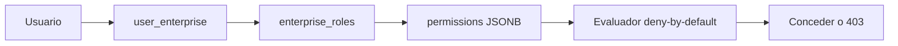

# Permisos de rol de empresa

Capa de **autorización por rol** dentro de una empresa a la que el usuario ya pertenece.

Firebase responde **quién eres**. El acceso por empresa responde **a qué empresas puedes entrar**. Esta capa responde **qué puedes hacer** en esa empresa.

El aislamiento de tenant sigue documentado en [Acceso por empresa](./enterprise-access.md). Aquí solo se describe el RBAC.

## Idea

Cada vínculo `user_enterprise` apunta a un rol (`enterprise_role_id` → `enterprise_roles`). El rol guarda un JSONB **disperso** de concesiones. Si una clave no está, la acción se **deniega**.

No hay permisos extra por usuario. No se usa un string `user_enterprise.role`. El administrador global (`users.role === administrator`) se salta tenant **y** RBAC.



## Modelo

| Tabla / campo | Significado |
|---|---|
| `enterprise_roles.id` | UUID del rol |
| `enterprise_roles.enterprise_id` | Empresa propietaria |
| `enterprise_roles.role` | Nombre visible (`Administrador`, `Empleado`, `signings`, u otro) |
| `enterprise_roles.permissions` | JSONB de concesiones |
| `user_enterprise.enterprise_role_id` | FK obligatoria al rol |

El DTO público del vínculo expone `enterpriseRoleId` y, si se pide la relación, `enterpriseRole` (nombre + permisos). **No** expone un campo `role` en la fila de unión.

## Roles sembrados

Al crear una empresa (`POST /enterprises`) se siembran dos roles:

| Nombre | Permisos | Notas |
|---|---|---|
| `Administrador` | `{"*":{"read":true,"write":true,"delete":true}}` | No se puede borrar, ni renombrar, ni cambiarle los permisos. |
| `Empleado` | `{}` | Deny by default. No se puede borrar. Se asigna si el alta de usuario no trae `enterpriseRoleId`. |

`signings` es un **nombre de rol** (terminal NFC / kiosco), no una columna. El backend lo trata por `enterprise_roles.role === 'signings'`.

## Catálogo

El catálogo vive **en código**, no en una tabla:

[`src/common/helpers/enterprise-permission/permission.catalog.ts`](../src/common/helpers/enterprise-permission/permission.catalog.ts)

También se expone en `GET /enterprise-roles/catalog`.

**Acciones:** `read` | `write` | `delete`.

**Recursos:**

`clients`, `suppliers`, `invoices`, `quotes`, `invoiceSeries`, `recurrentEarnings`, `spents`, `users`, `enterpriseRoles`, `enterprises`, `signings`, `vacations`, `holidays`, `workSchedules`, `defaultSchedules`, `billing`, `aiRequests`.

No hay recurso `userEnterprises`: el vínculo se crea o edita en el alta/edición de usuario (`users.write`). El kiosco NFC (`GET /user-enterprises/card/:cardId`) exige `signings.read`.

**Acciones por recurso:** el CRUD completo salvo estas excepciones (tampoco las abre el comodín `*`):

| Recurso | Acciones |
|---|---|
| `aiRequests` | solo `read` |
| `enterprises` | `read` y `write` (borrar empresa es solo admin global) |

El comodín `*` no es un recurso de negocio: concede la acción a **todos** los recursos del catálogo **si esa acción existe** para el recurso.

No inventes claves fuera de esta lista. Si un endpoint nuevo no encaja, **añade el recurso al catálogo** (backend y frontend) y documenta la acción.

## Evaluación

Fichero: [`src/common/helpers/enterprise-permission/permission.evaluator.ts`](../src/common/helpers/enterprise-permission/permission.evaluator.ts).

1. Si la acción no está en el contrato del recurso → denegar (aunque haya `*`).
2. Si `permissions` no es un objeto → denegar.
3. Si `permissions['*'][action] === true` → conceder.
4. Si `permissions[resource][action] === true` → conceder.
5. En cualquier otro caso → denegar.

Solo el booleano `true` concede. `false`, ausencia o valor raro deniegan.

Ejemplos:

```json
{}
```

Nada permitido (rol `Empleado`).

```json
{ "invoices": { "read": true, "write": true } }
```

Puede leer y crear/editar facturas. No puede borrarlas ni tocar clientes.

Al crear o actualizar un rol, si un recurso (o el comodín `*`) trae `write` o `delete` sin `read: true`, el API **quita** esas mutaciones. Revocar la lectura implica no poder crear ni borrar esa entidad. `{ "invoices": { "write": true } }` se persiste como `{}`. `{ "invoices": { "read": true, "write": true } }` se guarda tal cual. En el formulario, marcar escritura o eliminar sigue marcando lectura.

```json
{ "*": { "read": true, "write": true, "delete": true } }
```

Administrador de empresa: todas las acciones **admitidas** en cada recurso (no abre `enterprises.delete` ni `write`/`delete` de `aiRequests`).

No existe el recurso `metrics`. Cada `GET /metrics/…` exige `read` de la entidad consultada (`/metrics/clients/…` → `clients.read`, `/metrics/invoices/…` → `invoices.read`, `/metrics/ai-requests/…` → `aiRequests.read`, y así con gastos, presupuestos, usuarios, proveedores y series).

## API de roles

Prefijo: `/enterprise-roles`. Todas las rutas de tenant llevan `?enterpriseId=` y `@RequirePermission('enterpriseRoles', …)`.

| Método | Ruta | Permiso | Efecto |
|---|---|---|---|
| `GET` | `/enterprise-roles/catalog` | `enterpriseRoles` + `read` | Catálogo estático |
| `GET` | `/enterprise-roles` | `enterpriseRoles` + `read` | Lista de la empresa |
| `POST` | `/enterprise-roles` | `enterpriseRoles` + `write` | Alta (sin `read` se quitan `write`/`delete`) |
| `GET` | `/enterprise-roles/:id` | `enterpriseRoles` + `read` | Detalle (UUID) |
| `PATCH` | `/enterprise-roles/:id` | `enterpriseRoles` + `write` | Nombre y/o permisos (misma revocación de mutaciones) |
| `DELETE` | `/enterprise-roles/:id` | `enterpriseRoles` + `delete` | Baja (nunca `Administrador` ni `Empleado`) |

El alta de usuario acepta `userEnterprises: [{ enterpriseRoleId }]`. Un PATCH de usuario aplica ese id al vínculo de la empresa activa. **No** enviar un string `role`.

## Cómo está cableado en cada petición

Orden Nest: middleware → guards → interceptors → handler.

1. `FirebaseMiddleware` — identidad.
2. `EnterpriseAccessGuard` — pertenencia a la empresa.
3. `EnterprisePermissionGuard` — `@RequirePermission(recurso, acción)`.
   - Con `enterpriseId` en la petición: evalúa el JSONB **ahora**. Sin concesión → **403**.
   - Sin `enterpriseId` (ruta por UUID): el guard no puede decidir; el servicio evalúa tras el `findById`.
4. Servicio — `assertCurrentEntityAccessible(enterpriseId, '… no encontrado', { resource, action })`.

`users.role === administrator` salta los pasos 2 y 3.

### Decoradores

| Decorador | Efecto |
|---|---|
| `@RequirePermission('clients', 'read')` | Exige concesión. **Obligatorio** en rutas de `src/api`. |
| `@SkipEnterprisePermission()` | Omite solo el RBAC. |
| `@SkipEnterpriseAccess()` | Omite tenant **y** RBAC (el contexto sí se adjunta). |

Skip hoy: `GET /`, `GET /users/myself`, catálogo Stripe, `GET /billing/active-subscriptions` (módulos del menú; el vínculo de empresa sigue aplicando), `POST /enterprises`, `DELETE /enterprises/:id` (solo admin global).

## Cómo añadir o cambiar un endpoint (obligatorio)

Toda ruta nueva o tocada en `src/api` debe llevar las **tres** capas. El aislamiento por empresa no basta.

| Tipo de endpoint | Tenant | Permiso |
|---|---|---|
| Listado / create con `enterpriseId` en query | `@RequireEnterpriseId()` y pisar el body | `@RequirePermission(recurso, acción)` |
| GET / PATCH / DELETE / fichero por UUID | `assertCurrentEntityAccessible` tras el `findById` | El mismo assert con `{ resource, action }` + `@RequirePermission` en el controller |
| Health, perfil propio, catálogo autenticado | `@SkipEnterpriseAccess()` | Queda cubierto por el skip |
| Alta de empresa | `assertCanCreateEnterprise` | Solo admin global |

```typescript
@Get()
@RequireEnterpriseId()
@RequirePermission('clients', 'read')
@MapResponse(ClientResponseDto)
findAll(@Query('enterpriseId') enterpriseId: string) {
  return this.clientService.findAll(enterpriseId);
}

@Get(':id')
@RequirePermission('clients', 'read')
@MapResponse(ClientResponseDto)
async findById(@Param('id') id: string) {
  return this.clientService.findById(id);
}

// En el servicio, tras cargar la fila:
this.enterpriseAccessService.assertCurrentEntityAccessible(
  entity.enterpriseId,
  'Cliente no encontrado',
  { resource: 'clients', action: 'read' },
);
```

Mapeo habitual de verbos HTTP → acción:

| HTTP | Acción |
|---|---|
| `GET` (listado, detalle, export, preview) | `read` |
| `POST`, `PATCH` | `write` |
| `DELETE` | `delete` |

Si el recurso no existe en `PERMISSION_RESOURCES`, añádelo al catálogo **antes** de publicar la ruta. Replica el tipo en el frontend (`src/app/models/enterprise-permission.ts`).

## Códigos HTTP

| Caso | Código |
|---|---|
| Sin Bearer | 401 |
| `enterpriseId` de otra empresa | 403 |
| Sin concesión de rol (deny by default) | **403** |
| UUID de otra empresa (IDOR) | **404** |
| Recurso propio / admin global / rol `Administrador` (`*`) | 200/201 |
| Borrar `Administrador` o `Empleado`, o cambiar permisos del `Administrador` | 400 |
| Nombre de rol duplicado en la empresa | 409 |

403 de permiso **no** es 404: el usuario sí pertenece a la empresa; no tiene la acción. El cuerpo es `No tiene permiso para realizar la acción <recurso>.<acción>` (p. ej. `users.read`) para depurar desde la UI.

## Qué no hacer

- No reintroducir `user_enterprise.role` como string.
- No conceder por omisión («si no hay clave, dejar pasar»).
- No evaluar permisos a mano en el controller: usa el guard y `assertCurrentEntityAccessible`.
- No saltarte `@RequirePermission` «porque la pantalla ya oculta el botón».
- No meter `enterpriseId` ni permisos en el token de Firebase.

## Mapa de ficheros

| Fichero | Rol |
|---|---|
| `src/entities/enterprise-role/` | Entidad, repo, DTOs |
| `src/api/enterprise-role/` | CRUD HTTP + catálogo |
| `src/common/helpers/enterprise-permission/permission.catalog.ts` | Recursos, acciones, plantillas |
| `src/common/helpers/enterprise-permission/permission.evaluator.ts` | Deny by default y `*` |
| `src/common/decorators/enterprise-permission.decorator.ts` | `@RequirePermission` / `@SkipEnterprisePermission` |
| `src/common/guards/enterprise-permission.guard.ts` | Guard global de RBAC |
| `src/common/helpers/enterprise-access/access-context.ts` | `permissionsByEnterpriseId` |
| `src/common/helpers/enterprise-access/enterprise-access.service.ts` | `assertCanPerformEnterprisePermission` |

Tests de referencia: `permission.evaluator.spec.ts`, `enterprise-permission.guard.spec.ts`, `enterprise-role.service.spec.ts` y `test/e2e/access/permissions.e2e-spec.ts`.
